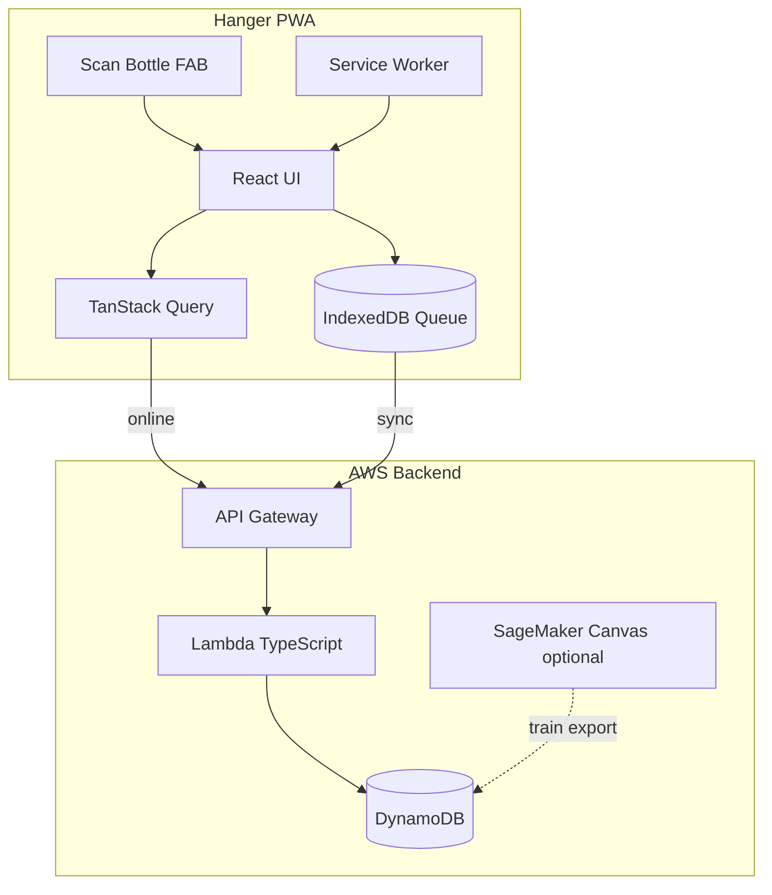

# Hanger Liquor Store — Architecture

## System overview

## Frontend stack

- React 19 + Vite + TypeScript
- Tailwind CSS + shadcn/ui
- TanStack Query (server state)
- React Hook Form + Zod (forms)
- html5-qrcode (UPC scanning)
- vite-plugin-pwa (offline shell)
- Recharts (forecast charts)

## Backend stack

- AWS Lambda (TypeScript)
- API Gateway
- DynamoDB tables: `HangerSalesHistory`, `HangerLocalEvents`, `HangerInventory`
- Lightweight statistical forecast in Lambda (weekday patterns, holidays, local events)
- Optional SageMaker Canvas for offline model training

## Key routes

| Route | Feature |
|-------|---------|
| `/` | Dashboard — stock overview, alerts |
| `/scan` | Scan page (camera modal) |
| `/inventory` | Full inventory list |
| `/events` | Local events (July 4th, football) |
| `/reports` | Forecast / reorder reports |