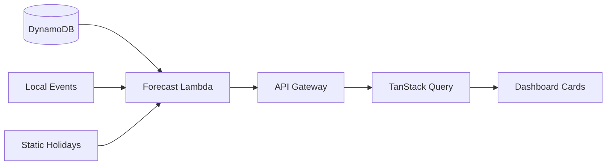

# Dashboard Flow

The Dashboard is the home screen for Hanger staff. It surfaces what matters most: stock health, movers, and reorder actions.

## Cards

1. **Stock overview** — Total SKUs tracked, count of low-stock items
2. **Fast movers** — Coors Light 12pk, Tito's Handmade Vodka 1L (high weekly turnover)
3. **Slow movers** — Niche whiskey SKUs with low velocity
4. **Low-stock alerts** — "Jack Daniel's Tennessee Whiskey 750ml — 3 bottles left"
5. **Reorder suggestions** — "Order 2 cases Coors Light before July 4th (+40% forecast multiplier)"

## Data flow

Staff see actionable cards first. Tapping a low-stock alert can jump to Inventory or trigger a scan.