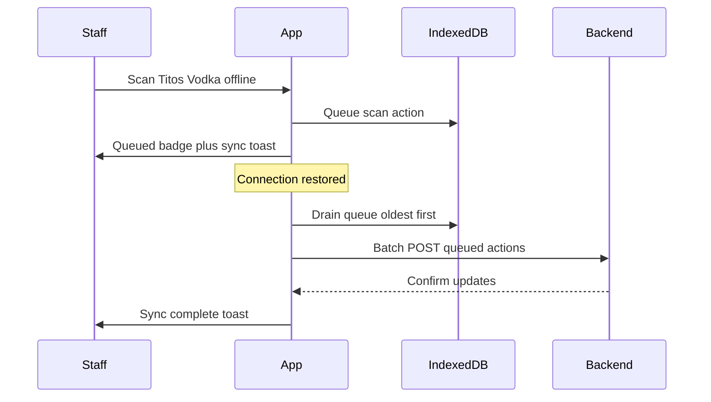

# Offline Sync Flow

Wiley, CO has spotty internet. The PWA queues staff actions locally and syncs when connectivity returns.



## Queued action shape

```typescript
interface QueuedAction {
  id: string;
  type: 'scan' | 'adjust' | 'sale';
  payload: { upc: string; delta: number };
  timestamp: number;
}
```

## UX rules

- Always show queued count in sync toast
- Optimistic UI updates immediately even when offline
- Retry failed sync items with exponential backoff