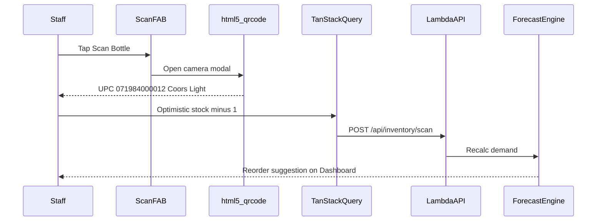

# Scan Flow

Staff tap the **Scan Bottle** FAB → camera opens → UPC detected → optimistic stock update → backend sync → forecast refresh.

## Example: Coors Light 12pk

## Offline behavior

If Wiley internet is down, the scan is queued in IndexedDB. See [offline-sync-flow.md](./offline-sync-flow.md).