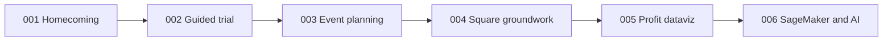

# Trial / First-Use Spec Roadmap

**Purpose:** Spec Kit holds Hangar Liquor trial business intent. Specs **002–006** ship in sequence under **001** homecoming.

**Shipped:** Gate A, **002** guided trial, **003** manager events, **004** Square analytics, **005** Profit & Ops, **006** optimization + AI.

## Spec status

| Spec                                                  | Role                              | Mode        |
| ----------------------------------------------------- | --------------------------------- | ----------- |
| [001](./001-client-homecoming/spec.md)                | North star / Gate B               | Spec        |
| [002](./002-owner-guided-trial/spec.md)               | First-use discovery               | **Shipped** |
| [003](./003-manager-event-planning/spec.md)           | Manager events                    | **Shipped** |
| [004](./004-square-analytics-groundwork/spec.md)      | Square Connect + analytics sync   | **Shipped** |
| [005](./005-owner-profit-dataviz/spec.md)             | Day/Month/Year + $ saved / $ made | **Shipped** |
| [006](./006-sagemaker-optimization-assistant/spec.md) | Optimization + Hangar AI chat     | **Shipped** |

## What Chris should believe

1. Run the store from the phone (scan, inventory, forecasts).
2. Local events are mine to plan (Hay Days / ice / beer).
3. The product puts money in my pocket (005 + 006).
4. Square feeds real sales (004).
