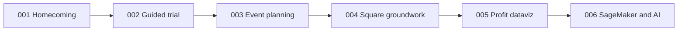

# Trial / First-Use Business Spec Roadmap

**Purpose:** Hangar Liquor Inventory is entering **trial / first-use** with Chris (Owner). Spec Kit holds the business intent. **No new feature implementation** until a later decision — refine specs, clarify acceptance, and sequence value.

**Shipped for trial demo (code):** Specs **002** + **003** (+ Gate A baseline).  
**Specs only (do not build yet):** **004 → 005 → 006**, still under **001** homecoming.

## What the trial business is selling

Chris should leave the first session believing:

1. **I can run the store from my phone** — scan, inventory, forecasts (demo path today).
2. **Local events are mine to plan** — Hay Days / ice / beer (003 shipped).
3. **The product will put money in my pocket** — not more charts for charts’ sake (005 + 006).
4. **Square is how real sales feed the story** — simple Connect for him; copy-paste for Steve (004).

Trial success ≠ full AWS handoff. Full handoff remains **001 Gate B**.

## Spec status (trial lens)

| Spec | Role in trial business | Mode now |
|------|------------------------|----------|
| [001](./001-client-homecoming/spec.md) | North star: staff-ready on client AWS | Spec / Gate B later |
| [002](./002-owner-guided-trial/spec.md) | First-use discovery for Chris | **Shipped** |
| [003](./003-manager-event-planning/spec.md) | Manager planning (Hay Days, ice/essentials) | **Shipped** |
| [004](./004-square-analytics-groundwork/spec.md) | Unlock real POS data for “money” story | **Spec only** — next to refine |
| [005](./005-owner-profit-dataviz/spec.md) | Day/Month/Year + $ saved / $ made | **Spec only** |
| [006](./006-sagemaker-optimization-assistant/spec.md) | Compute optimization + optional AI chat | **Spec only** (expand stub) |

## Specs-development rules (this phase)

1. Prefer clarifying FRs, acceptance, and “Chris sees X in Y minutes” over writing code.
2. Keep **YAGNI**: trial MVP for 005 can use mock/proxy dollars until 004/006 exist — say so explicitly in the spec.
3. Mark **demo-path** vs **live-path** requirements separately so Chris’s first meeting stays `npm run demo`.
4. Do not start `/speckit-implement` for 004–006 until product owner opens a build window.

## Next specs work (ordered)

1. **Refine 004** — Steve “enter this here” checklist + Chris Connect journey as acceptance table; analytics contract table (Orders/Payments/Catalog/Inventory → Hangar).
2. **Refine 005** — first viewport wireframe in prose (pulse + impact + one mix); define proxy formulas for demo without Square.
3. **Expand 006** — full user stories for optimization cash-impact; AI chat as P3 with grounding rules.
4. Optional: trial meeting script (which screens Chris sees in what order) linking 002 stops → 003 Hay Days → promise of 005.

## Out of scope this phase

- Implementing Square sync, Profit UI, SageMaker jobs, or chat UI
- Scope creep into Square Marketplace, multi-store, Cognito polish (unless blocking trial)
